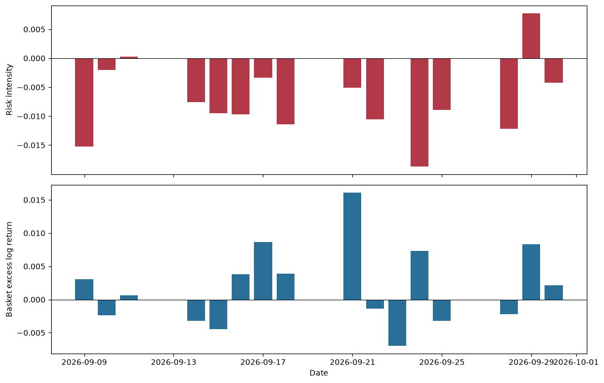
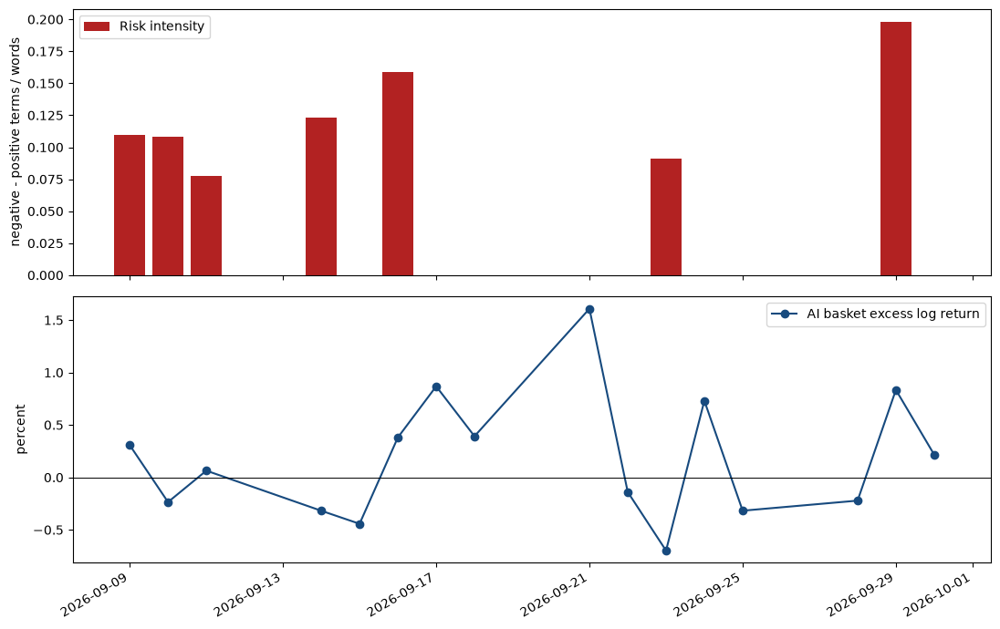

# AI-risk coverage and AI equities: an exploratory event study

**Observed window: September 8-30, 2026**  
**Prepared: September 30, 2026**

## Executive summary

On September 8, Anthropic employee Evan Hubinger replied on X that AI could kill all humans and put his personal probability above 10% within a decade, following Jacob Coxon’s resignation warning. [Axios](https://www.axios.com/2026/09/09/anthropic-insiders-warn-ai-could-kill-all-humans), [BBC](https://www.bbc.com/news/articles/cwy60w7r1kgo), and [Ars Technica](https://arstechnica.com/ai/2026/09/anthropic-researcher-quits-with-a-warning-self-improving-ai-could-kill-us-all/) documented the exchange.

The reproducible news sample is sharply risk-framed: mean VADER is **−0.400** versus **+0.014** for broad AI, and risk intensity is **0.158** versus **0.010**. Across 16 trading observations, the equal-weight AI basket returned **+2.88%** versus **−0.19%** for SPY; news-tone Granger tests do not reject no predictive content (p = .685 and .961).

The relevance-ranked X-post sample is instead slightly more positive and less risk-intense than broad-AI posts. Neither source has a significant one-lag Granger result; these 16 observations do not support a causal or return-prediction claim.

## Event, scope, and data

The event date is September 8, 2026, based on the supplied X post. The empirical window ends September 30, 2026; all tables, figures, and diagnostics were rerun together after that close.

### Social and news evidence

The supplied X posts anchor the event, not a representative X sample. The news notebook caches two dated Google News RSS searches for September 8–30.

1. **Event/risk sample:** Hubinger, Coxon, or Anthropic combined with AI-risk/existential/humanity terms. It yielded 56 headlines on eight calendar dates (September 9, 10, 11, 13, 14, 16, 23, and 29).
2. **Broad-AI comparison sample:** “artificial intelligence” or AI. It yielded 99 headlines in the same window.

Headlines receive VADER compound sentiment and risk intensity, `(negative-risk terms − positive/safety terms) / words`. This adapts the COVID-study comparison logic to a small, provider-ranked RSS sample; it cannot identify general-media bias.

The original notebook displays the following first ten dated event-query headlines; this is an exact notebook output, not a separate dataset.

| Date | Headline as displayed in notebook | Source |
|---|---|---|
| Sep. 9 | Ex-Anthropic Researcher Warns AI Threat to Hum... | 조선일보 |
| Sep. 9 | A researcher warned AI could end humanity. Con... | USA Today |
| Sep. 9 | Anthropic Researchers Raise Alarm Over A.I. Ac... | The New York Times |
| Sep. 9 | Anthropic insiders warn AI could kill all huma... | Axios |
| Sep. 9 | Experts weigh in as researcher says AI has mor... | CNBC |
| Sep. 9 | Anthropic Worker Quits Over AI Firms ‘Gambling... | bloomberg.com |
| Sep. 9 | AI could kill humanity, warns Anthropic scient... | Firstpost |
| Sep. 9 | Anthropic researcher believes more than 10% ch... | BBC |
| Sep. 9 | AI researchers 'earnestly believe' it could ki... | CBC |
| Sep. 9 | Could AI wipe out humanity in a decade? An Ant... | The Independent |

The attached Twitter and finance studies motivate daily aggregation, log returns, and transparent sentiment proxies; short-text classification remains a limitation.

### X-post archive sample

`TwitterAPIio_Archive_Sentiment_Analysis.ipynb` caches relevance-ranked Advanced Search results, applies the same measures, and filters New York timestamps to September 8–30. The samples span 22 calendar days but are query-defined rather than an X census.

| X-post comparison | Event/risk query | Broad-AI query | Difference |
|---|---:|---:|---:|
| Posts after date filter | 1,086 | 1,722 | −636 |
| Mean VADER compound | +0.1640 | +0.1435 | +0.0205 |
| Mean risk intensity | −0.0074 | +0.0007 | −0.0080 |

The targeted X sample is modestly **more positive** and has **lower** lexicon risk intensity than the broad-AI sample. It therefore supplies no analogous evidence of negative AI-risk coverage bias; the contrast with the news result illustrates source-specific framing, not platform-wide sentiment.

One-lag X-post tests have p-values **.2010**, **.9117**, and **.8876**; none rejects at 5%.

| Lag-1 X-post driver | p-value | Usable observations | Result at 5% |
|---|---:|---:|---|
| Mean compound sentiment | 0.2010 | 16 | Do not reject |
| Risk intensity | 0.9117 | 16 | Do not reject |
| Post count | 0.8876 | 16 | Do not reject |

X-post volume peaks at 104 on September 9 and 235 on September 30; tone is otherwise mixed. These are ranking-dependent sample patterns, and mixed excess returns plus the non-significant tests provide no reliable leading-return relationship.

The full executed X-post panel is below. As in the notebook, returns are decimal log returns and `0.0000` on September 23 represents no returned targeted post, not neutral social sentiment.

| Date | Basket return | Basket excess return | Posts | Mean compound | Risk intensity | Engagement |
|---|---:|---:|---:|---:|---:|---:|
| Sep. 9 | −0.0016 | 0.0031 | 104 | −0.0834 | −0.0152 | 138056 |
| Sep. 10 | −0.0084 | −0.0024 | 33 | −0.2949 | −0.0020 | 41770 |
| Sep. 11 | 0.0091 | 0.0006 | 17 | 0.0494 | 0.0003 | 1614 |
| Sep. 14 | −0.0077 | −0.0032 | 19 | 0.0732 | −0.0076 | 26260 |
| Sep. 15 | −0.0090 | −0.0044 | 24 | 0.2585 | −0.0095 | 56740 |
| Sep. 16 | −0.0006 | 0.0038 | 3 | 0.1505 | −0.0097 | 67 |
| Sep. 17 | 0.0200 | 0.0087 | 15 | −0.0752 | −0.0034 | 24735 |
| Sep. 18 | 0.0052 | 0.0039 | 6 | 0.3364 | −0.0114 | 8490 |
| Sep. 21 | 0.0315 | 0.0161 | 4 | 0.3087 | −0.0051 | 10584 |
| Sep. 22 | −0.0015 | −0.0014 | 4 | −0.2570 | −0.0106 | 1101 |
| Sep. 23 | −0.0142 | −0.0070 | 0 | 0.0000 | 0.0000 | 0 |
| Sep. 24 | 0.0065 | 0.0073 | 23 | 0.4566 | −0.0187 | 11861 |
| Sep. 25 | 0.0022 | −0.0032 | 80 | 0.2212 | −0.0089 | 2694 |
| Sep. 28 | −0.0097 | −0.0022 | 109 | 0.3743 | −0.0122 | 6134 |
| Sep. 29 | 0.0065 | 0.0083 | 181 | 0.0679 | 0.0078 | 7179 |
| Sep. 30 | 0.0001 | 0.0022 | 235 | 0.2802 | −0.0042 | 6088 |

### AI basket and returns

The basket contains NVIDIA (NVDA), Meta (META), Amazon (AMZN), Alphabet (GOOGL), Microsoft (MSFT), Broadcom (AVGO), and Taiwan Semiconductor (TSM). These firms span AI accelerators/foundry capacity, hyperscale cloud/model deployment, software platforms, and networking/custom silicon. It is an **equal-weight** basket: this is a transparent exposure screen, not a recommendation or a market-cap index. The benchmark is SPY. Yahoo Finance adjusted closes are downloaded by `yfinance`; the notebook calculates daily log return, the equal-weight basket return, and basket excess return (`basket − SPY`).

## Results

### Trend in coverage tone

The event/risk sample is substantially more negative than the broad-AI sample.

| Measure | Event/risk query | Broad-AI query | Difference |
|---|---:|---:|---:|
| Headlines | 56.000000 | 99.000000 | — |
| Mean VADER compound | −0.399796 | +0.014068 | −0.413864 |
| Mean risk intensity | 0.157827 | 0.010165 | +0.147662 |

Coverage is episodic: 10 headlines on September 9 (mean −0.516), negative covered days through September 23, and 31 headlines on September 29. The September 29 IPO-risk story is a later shock, not mechanically the September 8 event. Zeros mean no sampled headline, not neutral sentiment.

The chart and full aligned daily panel below reproduce the original notebook’s executed outputs. Returns are decimal log returns; `0.0000` for the news variables denotes no sampled event-query headline, not neutral public sentiment.

| Date | Headlines | Mean compound | Risk intensity | Basket return | Basket excess return |
|---|---:|---:|---:|---:|---:|
| Sep. 9 | 10 | −0.5160 | 0.1096 | −0.0016 | 0.0031 |
| Sep. 10 | 2 | −0.7211 | 0.1083 | −0.0084 | −0.0024 |
| Sep. 11 | 3 | −0.5356 | 0.0778 | 0.0091 | 0.0006 |
| Sep. 14 | 4 | −0.4070 | 0.1234 | −0.0077 | −0.0032 |
| Sep. 15 | 0 | 0.0000 | 0.0000 | −0.0090 | −0.0044 |
| Sep. 16 | 3 | −0.4607 | 0.1590 | −0.0006 | 0.0038 |
| Sep. 17 | 0 | 0.0000 | 0.0000 | 0.0200 | 0.0087 |
| Sep. 18 | 0 | 0.0000 | 0.0000 | 0.0052 | 0.0039 |
| Sep. 21 | 0 | 0.0000 | 0.0000 | 0.0315 | 0.0161 |
| Sep. 22 | 0 | 0.0000 | 0.0000 | −0.0015 | −0.0014 |
| Sep. 23 | 2 | −0.4450 | 0.0911 | −0.0142 | −0.0070 |
| Sep. 24 | 0 | 0.0000 | 0.0000 | 0.0065 | 0.0073 |
| Sep. 25 | 0 | 0.0000 | 0.0000 | 0.0022 | −0.0032 |
| Sep. 28 | 0 | 0.0000 | 0.0000 | −0.0097 | −0.0022 |
| Sep. 29 | 31 | −0.3316 | 0.1981 | 0.0065 | 0.0083 |
| Sep. 30 | 0 | 0.0000 | 0.0000 | 0.0001 | 0.0022 |

Within this event-focused RSS sample, risk framing is much more negative than broad AI coverage. Search selection and RSS ranking prevent a general-media-bias inference.

### Equity performance

Across September 9–30, the equal-weight basket compounded **+2.88%** versus **−0.19%** for SPY. Mixed daily excess returns do not show a stable relation to negative coverage. This is a descriptive comparison, not abnormal-return alpha.

### Granger diagnostic

For each driver, the notebook runs a one-lag bivariate Granger test with basket excess log return as the dependent series. The null is that the lagged driver does not improve the return forecast.

| Lag-1 driver | p-value | Result at 5% |
|---|---:|---|
| Mean headline compound | 0.6851 | Do not reject |
| Risk intensity | 0.9607 | Do not reject |
| Headline count | 0.8533 | Do not reject |

With only 16 observations, these bivariate tests are low power and non-causal; they neither establish nor rule out structural effects. A stronger design needs a longer window, richer text, independent social sampling, and market-model controls.

## Conclusion

The September 8 warning produced conspicuously negative sampled news coverage, but not negative relative tone in the relevance-ranked X-post sample. The news difference is a measurable **risk-framing differential**; the cross-source contrast shows why it is not evidence of general-media or platform-wide bias.

The basket outperformed SPY, but neither source supplies a significant next-day predictive relationship. The short sample supports no causal claim.

## Sources and methodological references

- Hubinger/Coxon event reporting: [Axios](https://www.axios.com/2026/09/09/anthropic-insiders-warn-ai-could-kill-all-humans); [BBC](https://www.bbc.com/news/articles/cwy60w7r1kgo); [Ars Technica](https://arstechnica.com/ai/2026/09/anthropic-researcher-quits-with-a-warning-self-improving-ai-could-kill-us-all/).
- X-post collection: [TwitterAPI.io Advanced Search](https://docs.twitterapi.io/api-reference/endpoint/tweet_advanced_search).
- Price source: [Yahoo Finance historical data](https://finance.yahoo.com/).
- News discovery source: [Google News RSS](https://news.google.com/rss); the notebook records the exact dated query and caches the response for audit.
- Carvalho, J. & Plastino, A. (2020). *On the evaluation and combination of state-of-the-art features in Twitter sentiment analysis.* Artificial Intelligence Review.
- Hogenboom, A. et al. (2014). *Twitter sentiment analysis applied to finance: A case study in the retail industry.* KDIR.
- Sacerdote, B., Sehgal, R. & Cook, M. (2020). *Why Is All COVID News Bad News?* NBER Working Paper 28110.
