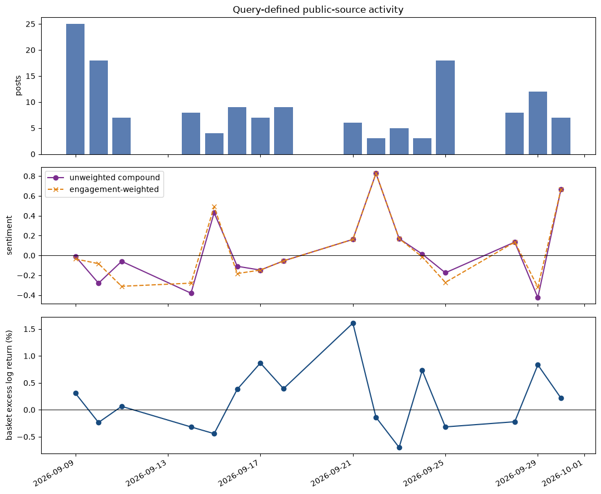

# AI-risk coverage and AI equities: an exploratory event study

**Observed window: September 8-30, 2026**  
**Prepared: September 30, 2026**

## Executive summary

On September 8, an Anthropic employee, Evan Hubinger, replied on X that AI could kill all humans and put his personal probability above 10% in the next decade. The exchange followed Jacob Coxon’s resignation and warning. The event was rapidly amplified by news outlets: [Axios](https://www.axios.com/2026/09/09/anthropic-insiders-warn-ai-could-kill-all-humans), [BBC](https://www.bbc.com/news/articles/cwy60w7r1kgo), and [Ars Technica](https://arstechnica.com/ai/2026/09/anthropic-researcher-quits-with-a-warning-self-improving-ai-could-kill-us-all/) all documented the claims and surrounding debate.

In a reproducible, date-filtered news-headline sample, the event/risk query has a mean VADER compound score of **−0.400** against **+0.014** for a contemporaneous broad-AI comparison query; its transparent risk-language measure is **0.158** versus **0.010**. This is strong descriptive evidence that the sampled event coverage was risk-framed. In addition, over the **16 aligned trading observations** (September 9–30), an equal-weight basket of NVDA, META, AMZN, GOOGL, MSFT, AVGO, and TSM returned **+2.88%**, versus **−0.19%** for SPY. One-lag Granger diagnostics do not reject the null that headline tone or risk intensity adds predictive content for next-day basket excess returns (p = .685 and .961, respectively).

Coverage can be negative while markets look through it, price company-specific information, or react contemporaneously rather than with a one-day lag. More importantly, 15 return observations do not support a credible causal claim. The correct conclusion is narrow: this particular risk-framed news sample is measurably more negative than a broad-AI comparison sample, but this exercise does not find reliable short-run predictive evidence that the measured tone moved the selected basket.

## Event, scope, and data

The event date is September 8, 2026, based on the supplied X post. The empirical window ends September 30, 2026; all tables, figures, and diagnostics were rerun together after that close.

### Social and news evidence

The event is social-media originated: Coxon posted his resignation and warning on X; Hubinger publicly endorsed the concern; the supplied account link is [@EvanHub](https://x.com/EvanHub). These posts are the event anchor, not a representative sample of X. Rather than label an incomplete social-media scrape as “social-media sentiment,” the quantitative measure is explicitly limited to **news headlines**.

The notebook pulls two dated Google News RSS searches, caches the exact XML locally, and filters to September 8-30.

1. **Event/risk sample:** Hubinger, Coxon, or Anthropic combined with AI-risk/existential/humanity terms. It yielded 56 headlines on eight calendar dates (September 9, 10, 11, 13, 14, 16, 23, and 29).
2. **Broad-AI comparison sample:** “artificial intelligence” or AI. It yielded 99 headlines in the same window.

Each headline receives two transparent scores: VADER’s compound sentiment score and a risk-intensity score, `(negative-risk terms − positive/safety terms) / headline word count`. The lexicon is printed in the notebook. This follows the spirit, not the scale, of Sacerdote, Sehgal, and Cook’s comparison of COVID coverage with alternatives: compare tone against a contemporaneous benchmark and state the universe constraint. Their result used millions of articles and human/ML validation; this project uses a small, provider-ranked RSS sample and therefore makes no claim about all media.

The original notebook displays the first ten dated event-query headlines. A compact illustration is below; it is not a separate source or an additional social-media dataset.

| Date | Headline as displayed in notebook | Source |
|---|---|---|
| Sep. 9 | Anthropic Researchers Raise Alarm Over A.I. Ac… | The New York Times |
| Sep. 9 | Anthropic insiders warn AI could kill all huma… | Axios |
| Sep. 9 | Anthropic researcher believes more than 10% ch… | BBC |

The attached Twitter and finance studies motivate daily aggregation and a relative sentiment construction. In particular, the finance study defines log returns and a relative sentiment measure based on positive and negative daily messages. Here, daily log returns and a transparent headline polarity proxy replace proprietary Twitter counts. Carvalho and Plastino motivate caution because short, informal posts are difficult to classify; that concern is one reason this analysis does not claim that the supplied posts alone measure public sentiment.

### AI basket and returns

The basket contains NVIDIA (NVDA), Meta (META), Amazon (AMZN), Alphabet (GOOGL), Microsoft (MSFT), Broadcom (AVGO), and Taiwan Semiconductor (TSM). These firms span AI accelerators/foundry capacity, hyperscale cloud/model deployment, software platforms, and networking/custom silicon. It is an **equal-weight** basket: this is a transparent exposure screen, not a recommendation or a market-cap index. The benchmark is SPY. Yahoo Finance adjusted closes are downloaded by `yfinance`; the notebook calculates daily log return, the equal-weight basket return, and basket excess return (`basket − SPY`).

## Results

### Trend in coverage tone

The event/risk sample is substantially more negative than the broad-AI sample.

| Measure | Event/risk query | Broad-AI query | Difference |
|---|---:|---:|---:|
| Headlines | 56 | 99 | — |
| Mean VADER compound | −0.400 | +0.014 | −0.414 |
| Mean risk intensity | 0.158 | 0.010 | +0.148 |

The daily pattern is concentrated rather than smoothly trending. The original event produces a September 9 burst of 10 sampled headlines, with negative mean tone (−0.516). Covered trading dates remain negative through September 23, including September 10 (−0.721) and September 16 (−0.461). A much larger September 29 cluster belongs to a later Anthropic IPO-risk disclosure story and should be treated as a separate information shock, rather than mechanically attributed to the September 8 posts. September 29 and September 30 trading returns are now included; only September 29 has sampled event-query coverage. No-coverage days are assigned zero, meaning no sampled headline activity rather than negative sentiment.

The chart and selected-date table below reproduce the key movements in the original notebook’s aligned daily panel; the full 16-day panel remains in the notebook. Returns are decimal log returns; `0.0000` for the news variables denotes no sampled event-query headline, not neutral public sentiment.

| Date | Headlines | Mean compound | Risk intensity | Basket return | Basket excess return |
|---|---:|---:|---:|---:|---:|
| Sep. 9 | 10 | −0.5160 | 0.1096 | −0.0016 | 0.0031 |
| Sep. 10 | 2 | −0.7211 | 0.1083 | −0.0084 | −0.0024 |
| Sep. 14 | 4 | −0.4070 | 0.1234 | −0.0077 | −0.0032 |
| Sep. 23 | 2 | −0.4450 | 0.0911 | −0.0142 | −0.0070 |
| Sep. 29 | 31 | −0.3316 | 0.1981 | 0.0065 | 0.0083 |
| Sep. 30 | 0 | 0.0000 | 0.0000 | 0.0001 | 0.0022 |

This supports a carefully worded media-bias finding: **within this event-focused RSS sample, risk framing is much more negative than contemporaneous broad AI coverage.** It does not identify why. Search terms intentionally retrieve risk coverage, RSS ranking may favor dramatic stories, and an unobserved outlet mix or reader demand can generate the result. The COVID paper’s “bias” language is useful as a question, but its evidence threshold is far higher than this small study can meet.

### Equity performance

For the 16 aligned trading observations from September 9 through September 30, the equal-weight AI basket compounded **+2.88%**; SPY compounded **−0.19%**. This positive window-level relative performance coexists with markedly negative event-coverage tone, so it does not support a simple narrative in which negative AI-risk discussion persistently reduced the value of the selected AI equities. The difference is not an event abnormal return estimated from a pre-event model, and should not be read as alpha. It is a descriptive market-adjusted comparison over the study window.

Daily excess returns were mixed. The basket underperformed SPY on September 10, 14, 15, and 23, but outperformed on September 17, 18, 21, and 24. There is no stable visual correspondence between the covered negative-news days and the sign of the basket’s excess return. That is economically plausible: these equities also respond to earnings, rates, chip demand, product developments, and broad risk appetite in addition to AI-safety narratives.

### Granger diagnostic

For each driver, the notebook runs a one-lag bivariate Granger test with basket excess log return as the dependent series. The null is that the lagged driver does not improve the return forecast.

| Lag-1 driver | p-value | Result at 5% |
|---|---:|---|
| Mean headline compound | 0.6851 | Do not reject |
| Risk intensity | 0.9607 | Do not reject |
| Headline count | 0.8533 | Do not reject |

There are 16 usable daily observations. With a lag and an intercept, degrees of freedom are extremely limited; zeros on no-coverage days further weaken variation. A Granger test also says nothing by itself about structural causality. Accordingly, the evidence does **not** show that changes in the measured sentiment Granger-caused positive or negative returns. It also cannot establish the reverse. A credible extension would use a longer pre/post period, article-body text, an independently sampled social-data universe, a pre-specified universe of outlets, and a market-model event-study design with controls.

## Hacker News social-discourse analysis

The separate public-source notebook collects a fixed-query sample of Hacker News stories and comments using the public Algolia index. It searches `Evan Hubinger`, `Jacob Coxon`, `Anthropic AI risk`, and `Anthropic alignment`, deduplicates observations, and applies the same VADER and transparent risk-intensity measures used for the news analysis. This is a query-defined, technically oriented community sample; it is not a representative sample of all X users, investors, or the public.

| Hacker News measure, Sep. 8–30 | Result |
|---|---:|
| Unique stories/comments | 211 |
| Covered calendar days | 23 |
| Mean VADER compound | −0.0350 |
| Mean risk intensity | 0.0163 |
| Median engagement | 1 |
| AI-basket cumulative return | +2.88% |
| SPY cumulative return | −0.19% |

The sample is sustained but uneven: it has 25 observations on September 9, 18 on September 10, and 12 on September 29. Mean tone is mildly negative overall, rather than uniformly catastrophic. These patterns describe a selected discussion sample, not platform-wide social sentiment.

| Selected date | HN posts | Mean compound | Risk intensity | Basket excess return |
|---|---:|---:|---:|---:|
| Sep. 9 | 25 | −0.0087 | 0.0206 | 0.0031 |
| Sep. 10 | 18 | −0.2797 | 0.0201 | −0.0024 |
| Sep. 14 | 8 | −0.3802 | 0.0276 | −0.0032 |
| Sep. 29 | 12 | −0.4252 | 0.0833 | 0.0083 |
| Sep. 30 | 7 | 0.6675 | 0.0054 | 0.0022 |

The same one-lag bivariate Granger design supplies no detectable incremental predictive signal from this Hacker News sample to next-day basket excess return.

| Lag-1 Hacker News driver | p-value | Result at 5% |
|---|---:|---|
| Mean compound sentiment | 0.6543 | Do not reject |
| Risk intensity | 0.4484 | Do not reject |
| Post count | 0.7680 | Do not reject |
| Engagement-weighted compound | 0.7159 | Do not reject |

These tests have only 16 aligned trading observations and are not structural-causality tests. The source-specific conclusion is that this sample contains episodic risk-oriented discussion but no reliable one-day-ahead association with basket excess return.

## Conclusion

The September 8 social-media warning produced conspicuously negative sampled news coverage. Relative to broad AI coverage, the difference in both lexicon-based and VADER tone is large enough to call it a measurable **risk-framing differential**. It is not enough to call it a general-media bias, because the selection mechanism and data universe are too narrow.

The selected AI basket nevertheless outperformed SPY over the observed window. The requested one-lag Granger checks show no predictive relationship from the constructed news-tone measures to next-day excess return. The defensible takeaway is therefore nuanced: the conversation was negative; the basket did not exhibit an obvious persistent negative return response; and this short, noisy sample cannot convert either observation into a causal story.

## Sources and methodological references

- Hubinger/Coxon event reporting: [Axios](https://www.axios.com/2026/09/09/anthropic-insiders-warn-ai-could-kill-all-humans); [BBC](https://www.bbc.com/news/articles/cwy60w7r1kgo); [Ars Technica](https://arstechnica.com/ai/2026/09/anthropic-researcher-quits-with-a-warning-self-improving-ai-could-kill-us-all/).
- Price source: [Yahoo Finance historical data](https://finance.yahoo.com/).
- News discovery source: [Google News RSS](https://news.google.com/rss); the notebook records the exact dated query and caches the response for audit.
- Carvalho, J. & Plastino, A. (2020). *On the evaluation and combination of state-of-the-art features in Twitter sentiment analysis.* Artificial Intelligence Review.
- Hogenboom, A. et al. (2014). *Twitter sentiment analysis applied to finance: A case study in the retail industry.* KDIR.
- Sacerdote, B., Sehgal, R. & Cook, M. (2020). *Why Is All COVID News Bad News?* NBER Working Paper 28110.
